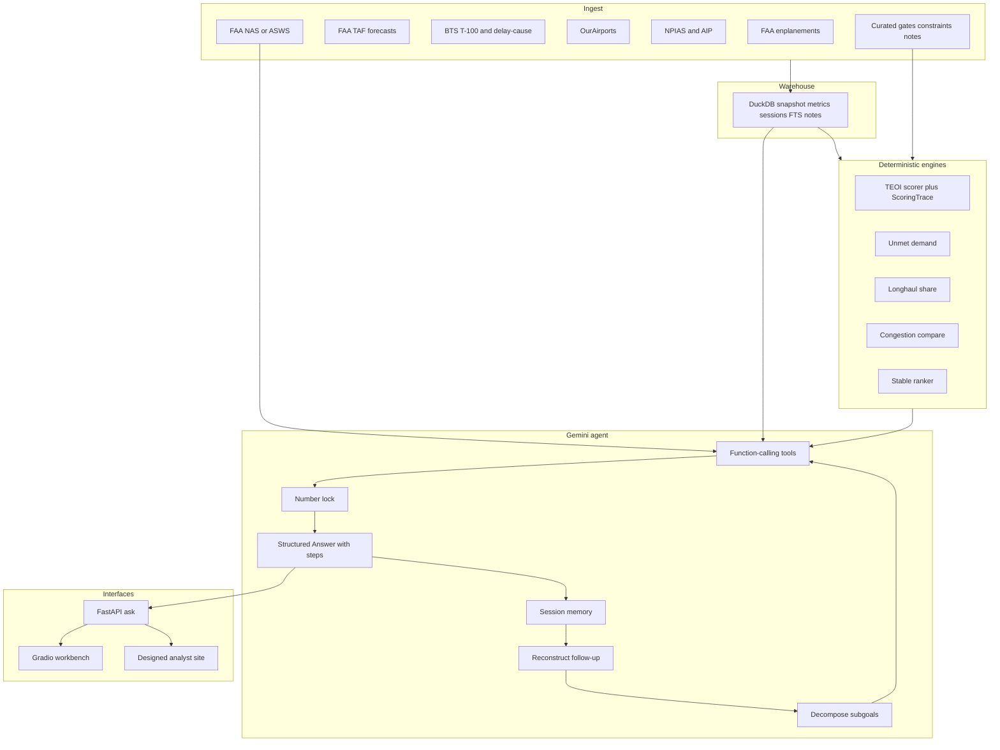

# Navaid architecture

Assignment deliverable: scoring methodology, key tradeoffs, and where/how Gemini is used versus deterministic engines.

Related: [GLOSSARY.md](GLOSSARY.md), [DECISION_LOG.md](DECISION_LOG.md).

**Default chat model:** `gemini-2.5-flash` (`NAVAID_MODEL` can override to Pro).  
**RAG:** DuckDB FTS + airport-keyed notes. **No embedding model. No Chroma.**

---

## Assignment brief

**Title:** Airport Investment Intelligence Agent

**Goal:** We are a firm that invests in airport modernization projects in the US. We are exploring how AI agents can help analysts identify promising airport investment opportunities. The goal of the agent is to help us identify airports where renovations will be most profitable based on increased flight and passenger capacity.

**The agent must answer questions such as:**

- Which airports in New England are strong candidates for terminal expansion?
- Compare LA and Santa Ana airport congestion levels.
- What is the percentage of long haul flights out of Anchorage airport?
- What is the unmet flight demand in SFO airport and why?

**The agent should:**

- Use public APIs to gather airport/aviation data
- Rank or compare airports based on defined logic or KPI
- Explain its reasoning clearly
- Support conversational follow-up questions

**Requirements:**

- Include some deterministic scoring or ranking logic (not only LLM output)
- Include a chat interface to talk with the agent (voice is a bonus)
- Clearly communicate assumption, uncertainty and scoping

**Deliverables:**

- Source code
- Short design/architecture document explaining scoring methodology, key tradeoffs, and where/how AI is used *(this file)*

The original brief mentioned an approximately one-day timeframe and asked to prioritize clarity over polish. That is not a cut line. Navaid is a complete local analyst system.

---

## Product in one paragraph

Public aviation files are **ingested** into a local **DuckDB warehouse**. **Deterministic engines** compute TEOI (with a full `ScoringTrace`), unmet demand, long-haul share, and congestion compares. A **Gemini agent** first **reconstructs** follow-ups, **decomposes** multi-part questions, then may only call those engines as **tools**. A **number lock** rejects any digit that was not in a tool payload. **Gradio** and a **designed site** share local FastAPI `/ask`.

Gemini may explain a rank; it may never produce one. Every ranking answer includes the **full TEOI working** (raw inputs, peer min-max, weights, drops, constraint multiplier, final score). Follow-ups go through a **reconstruction** step. A question made of several questions is **decomposed** and **all parts are answered**.

---

## System diagram



**How to read this flowchart**

- **Top to bottom:** raw public data → local database → math → Gemini explanation → UI.
- **Ingest** does not talk to the user. It fills DuckDB.
- **Live** (FAA NAS/ASWS) skips the warehouse: right-now delay overlay, not a historical score input.
- **Cur** (hand-authored gates/curfews) feeds engines because those fields are not in OurAirports.
- **Reconstruct** runs before tools on every turn. **Decompose** splits compound questions so no sub-question is dropped.

### Agent graph (every `/ask`)


---

## Layers

### Ingest (batch job, not chat)

Download, parse, filter to US commercial airports, write clean tables via `scripts/build_snapshot.py`.

| Source | What it contributes |
| --- | --- |
| FAA enplanements | Yearly passenger boardings, hub size, YoY |
| FAA TAF | 10-year passenger/operations forecast (planning TAF, not weather) |
| BTS T-100 | Route passengers, seats, distance, international flag (segment, not O&D) |
| BTS delay-cause | Airport-month delay/cancel (not millions of flight rows) |
| OurAirports | IATA/ICAO, lat/lon, runways |
| NPIAS and AIP | Development need and grant history (feasibility, not the rank) |
| FAA NAS or ASWS | Live ground stops / delay programs (tool-time overlay) |
| Curated | Gates, CBSA catchment, constraint type, qualitative notes |

### Warehouse

One file `data/warehouse/navaid.duckdb`: metric tables, `sessions` (follow-up memory), `doc_chunks` with FTS (RAG). Snapshot has `as_of` and a content hash. **No embeddings table.**

`NAVAID_OFFLINE=1`: no government HTTP; local DuckDB only.

### RAG (not a ranker)

Airport-keyed `doc_chunks` + **DuckDB FTS**. Chunks `{airport, doc_type, as_of, url}`. The corpus is tens of notes, not millions of pages — `WHERE airport = ?` plus keyword match is the retrieval that fits.

- RAG **never ranks**.
- If corpus and T-100 disagree, **T-100 wins**; disagreement is an uncertainty.
- **No embedding model. No Chroma, FAISS, or Pinecone.**

### Engines (math, not AI)

TEOI + **ScoringTrace**, unmet demand, long-haul share, congestion compare, stable ranker. Same input → same output. Engine tests do not need Gemini.

### Gemini agent

Default model **gemini-2.5-flash** via official `google-genai`. Auth is **Google Cloud ADC** (`gcloud auth login --update-adc` + a GCP project on Vertex AI) or `GEMINI_API_KEY` for the Gemini Developer API. `NAVAID_MODEL=gemini-2.5-pro` is an override for narration quality, not numeric correctness.

Reconstruct → decompose → tools → number lock → structured `Answer` (prose + steps + TEOI traces + envelope). Session written back to DuckDB. Automatic function calling (AFC) is **disabled**.

### Interfaces

FastAPI `/ask`, Gradio workbench, designed site. All consume the same `Answer` object. Voice: Gemini audio on `/ask`.

---

## Scoring methodology

### Investment thesis

Terminal renovations are most profitable where they **unlock flight and passenger capacity**. Busy is not investable.

- **Landside-bound** (gates, holdrooms, security, bag claim, curb): terminal capex can raise throughput. High TEOI.
- **Airside-bound** (runways, slots, weather, ATC, noise curfew): more terminal does not create slots. Score penalized; the answer must say so.
- **Demand-bound** (weak catchment, low load factor, leakage already served nearby): expansion is speculative.
- **Already-funded:** NPIAS/AIP money committed; incremental private return may be lower.

Profit is a **capacity-unlock proxy**, not PFC/bond/NPV. Product copy says so.

Canonical spoken answers:

- **SFO unmet:** high load factors, leakage to OAK/SJC, delay, slot/curfew. Much of the gap is airside/policy, not a missing concourse. Unmet is `max(0, implied − served)`.
- **LAX vs SNA:** LAX wins absolute delay volume; SNA is high-utilization and curfew-capped. Compare delay + utilization + constraint type. `"LA"` → LAX; `"Santa Ana"` → SNA, not SAT.
- **ANC long-haul:** default Eurocontrol **>4000 km** on T-100 **segments**; also **>6h** and **international share**. Cargo out unless asked.
- **New England:** BOS is scale; BDL/PVD/PWM/MHT can win as landside-constrained regionals. Peer-relative, not “biggest wins.” New England = CT, ME, MA, NH, RI, VT. PWM is Portland Maine, not PDX.

### TEOI formula

**TEOI** (Terminal Expansion Opportunity Index) is 0–100. Peer-relative min-max inside comparison set `S`. Weights in `navaid/scoring/weights.py` sum to 1.0. Missing feature: **drop and renormalize** (never invent the missing value).

```
TEOI = 100 * (
  0.22 * demand_pressure +
  0.18 * congestion +
  0.18 * landside_saturation +
  0.15 * unmet_demand +
  0.12 * yield_mix +
  0.10 * growth_outlook +
  0.05 * capital_feasibility
) * constraint_multiplier
```

| Feature | Default weight | Role |
| --- | --- | --- |
| Demand pressure | 0.22 | Enplanements / YoY pressure vs peers in `S` |
| Congestion | 0.18 | Delay / cancel / utilization vs peers |
| Landside saturation | 0.18 | Pax per gate (or related landside load) vs peers |
| Unmet demand | 0.15 | Load-factor gap + TAF gap + leakage (see below) |
| Yield mix | 0.12 | Long-haul / international mix as a yield proxy |
| Growth outlook | 0.10 | TAF / CAGR outlook vs peers |
| Capital feasibility | 0.05 | NPIAS/AIP feasibility; often the dropped weight |

**Constraint multiplier** (applied after the weighted sum):

| Constraint type | Multiplier | Meaning |
| --- | --- | --- |
| Landside | 1.00 | Terminal capex can unlock capacity |
| Mixed | 0.75 | Partly airside |
| Airside | 0.40 | Slots / runway / curfew / ATC bind |
| Demand-bound | 0.30 | Weak catchment; expansion is speculative |

### Unmet demand (clamped at 0)

- Load-factor gap: `served * max(0, LF − 0.85) / 0.85`
- Forecast gap: `max(0, TAF_10y − implied_current_capacity)` if TAF exists
- Leakage: same-CBSA airports growing faster while origin LF is high

### Long-haul

Great-circle kilometres on T-100 **segments**. Default threshold **4000 km** (Eurocontrol). Also report international share and optional `pct_over_6h`. Pin `ANC→JFK` (~5420 km / 3370 mi).

### Ranker

Shared ranks (3, 3, 5); leftover ties by ICAO ascending. Deterministic.

### Congestion compare

No fake single congestion score. Payload:

`{delay_pct, avg_arrival_delay_min, cancel_pct, ops_per_runway, live_faa_status, constraint_type, winner_on_each_axis}`

### ScoringTrace

Attached whenever TEOI ran. Gemini’s prose may quote these fields. It may not invent a different formula. Gradio/site render a **waterfall** from the same JSON even if the model is terse.

Example shape:

```
airport: BDL
peer_set: [BOS, BDL, PVD, PWM, MHT, BTV]
raw: {enplanements: 3285194, yoy: 0.052, pax_per_gate: ..., delay_pct: ..., lf: ...}
scaled_0_1: {demand_pressure: 0.41, congestion: 0.55, ...}  # min-max inside peer_set
weights_original: {demand_pressure: 0.22, ...}
weights_dropped: [capital_feasibility]  # missing NPIAS
weights_used: {demand_pressure: 0.232, ...}  # renormalized
contributions: {demand_pressure: 9.5, congestion: 10.4, ...}  # 100 * weight * scaled
weighted_sum: 61.2
constraint_type: landside
constraint_multiplier: 1.00
teoi: 61.2
rank: 2
formula_text: "TEOI = 100 * (0.232*demand + ...) * 1.00"
```

### Envelope

Every engine returns an Envelope. Every `/ask` copies it onto the answer:

- assumptions
- uncertainties (stale snapshot >90 days is **always** listed)
- out_of_scope
- confidence
- sources
- as_of

### Worked steps (New England rank)

1. Reconstruct: n/a (first turn)
2. Decompose: one subgoal `EXPANSION_RANK` region=New England
3. Resolve airports: BOS, BDL, PVD, PWM, MHT, BTV, …
4. Pull warehouse metrics `as_of=…`
5. Compute unmet, yield mix, congestion per airport
6. Min-max each feature inside `S`
7. Drop missing weights; renormalize
8. Apply constraint multipliers
9. Stable rank
10. Number lock
11. Narrate from traces

---

## Answer contract

Every `/ask` response is an `Answer`:

| Field | Role |
| --- | --- |
| `reconstructed_query` | Standalone question after follow-up rewrite (equals the user text on turn 1) |
| `subgoals[]` | Each part of a compound question (`intent`, `entities`, `status`) |
| `steps[]` | Ordered working — reconstruct, tools called, engines run, numbers locked |
| `sections[]` | One section per subgoal (multi-part questions cannot collapse) |
| `teoi_traces[]` | Full `ScoringTrace` for every airport that was scored |
| `tables` | Rankings / compare grids copied from engines |
| `envelope` | Assumptions, uncertainties, out_of_scope, confidence, sources, as_of |
| `citations[]` | Sources shown to the analyst |
| `unsupported_parts[]` | Pieces we refused (e.g. “buy AAL”) without discarding the rest |

Closed intents: `EXPANSION_RANK`, `CONGESTION_COMPARE`, `LONGHAUL_SHARE`, `UNMET_DEMAND`, `AIRPORT_BRIEF`, `EXPLAIN_TEOI`, `FOLLOW_UP` (flag only; reconstruction turns it into a real intent), `UNSUPPORTED`.

Tools: `resolve_airport`, `rank_expansion`, `compare_congestion`, `longhaul_share`, `unmet_demand`, `airport_metrics`, `explain_teoi`, `search_corpus`, `get_live_status`.

---

## Where Gemini is used vs deterministic engines

| Job | Who | Notes |
| --- | --- | --- |
| Ingest, snapshot, SQL | Deterministic | `scripts/build_snapshot.py`, DuckDB |
| TEOI, unmet, long-haul, congestion, rank | **Engines** | Full `ScoringTrace`; pytest without a key |
| FTS retrieval | DuckDB | Airport key + keywords; **no embeddings** |
| Reconstruct follow-up | Gemini (schema) + session tables | Standalone question from last entities/traces |
| Decompose compound questions | Gemini (schema) or rules + Gemini | All subgoals executed |
| Choose tools / fill arguments | Gemini function calling | Manual loop; AFC off |
| Run tools | Python engines / warehouse / live FAA | Model does not compute the number |
| Number lock | Python | Every digit in prose must exist in tool JSON |
| Narrate sections | Gemini | May quote traces; may not change the formula |
| Rank or invent KPI | **Never Gemini** | Fails the brief |

Default model: **gemini-2.5-flash**. Scoring correctness does not depend on Pro. Override `NAVAID_MODEL` only if narration quality needs a bump.

The only required cloud service is Gemini. Live FAA NAS/ASWS is optional overlay and is skipped under `NAVAID_OFFLINE=1`.

---

## Key tradeoffs

| Tradeoff | Choice | Why |
| --- | --- | --- |
| Official files vs live APIs | Files are the warehouse; NAS/ASWS is overlay | Reproducible gold numbers; live delay is “right now,” not TEOI |
| Peer-relative vs national scores | Min-max inside the asked set `S` | A New England question must not be dominated by ATL/LAX |
| Missing gates / TAF / NPIAS | Drop-and-renormalize, disclose | Never invent counts |
| RAG vs tools | RAG never ranks; T-100 wins facts | Notes explain; traffic measures |
| Manual Gemini loop vs LangChain / AFC | Hand-rolled orchestrator, AFC off | Need traces and the number lock in our Python |
| FTS vs embeddings / Chroma | DuckDB FTS + airport key | Tens of notes; no second DB, no embedding model |
| Flash vs Pro as default | **gemini-2.5-flash**; Pro via `NAVAID_MODEL` | Numbers come from engines; Flash is cheaper and snappier |
| Gradio vs designed site | Same `Answer` object; site is a skin | One contract for eval, chat, and polish |
| Reconstruct vs raw chat history | Explicit rewrite | Follow-ups are testable |
| Capacity unlock vs airport finance | Capacity unlock, stated as such | We will not fake PFC/NPV |
| Segment vs O&D | T-100 segment | True O&D is not in the public files we use |

---

## Assumptions in product copy

- US commercial primary airports; New England = CT, ME, MA, NH, RI, VT
- Profit proxy is **capacity unlock**, not PFC/bond/NPV
- T-100 is segment traffic, not true O&D
- Long-haul default 4000 km
- Live FAA status is operations delay, not passenger demand
- Missing gates/TAF/NPIAS are dropped and disclosed
- Gemini is the only required cloud service
- Default model is gemini-2.5-flash
- RAG is DuckDB FTS + airport-keyed notes — no embedding model, no Chroma
